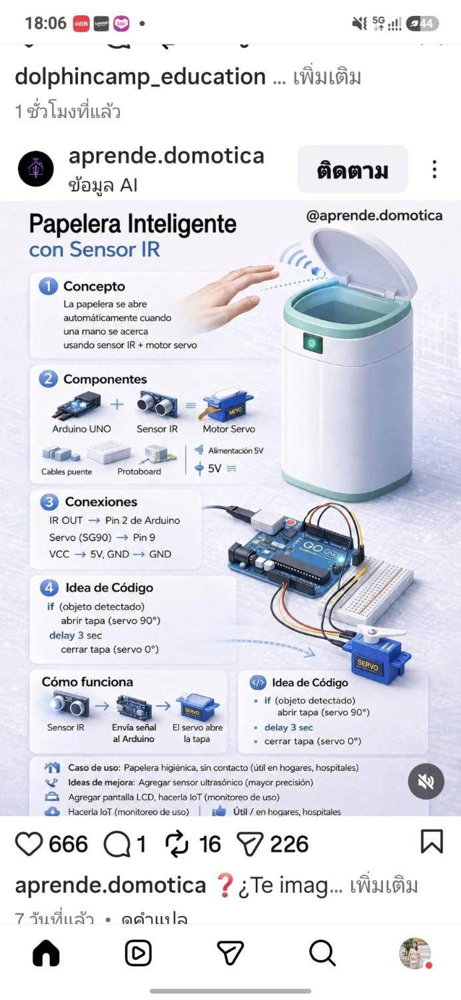

# 🗑️ Smart Trash Can with IR Sensor

**An automatic, touch-free trash can that opens its lid when it detects your hand.**



## Overview

This project uses an **Arduino UNO**, an **IR proximity sensor**, and a **servo motor** to create a smart trash can that automatically opens its lid when a hand is detected nearby, then closes after a delay — no touching required. Perfect for hygiene, accessibility, and just being cool.

## Feasibility Analysis

| Aspect | Assessment |
|--------|------------|
| **Cost** | ~$5–10 USD (Arduino Nano/UNO clone + SG90 servo + IR sensor) ✅ Very affordable |
| **Complexity** | Beginner-friendly — basic digital read, servo PWM output ✅ |
| **Power** | USB power bank (5V) or 9V battery ✅ Portable |
| **Real-world use** | Proven — dozens of tutorials, Instructables, and YouTube builds exist ✅ |
| **Limitations** | IR sensor works best at close range (~5–30cm); bright sunlight can interfere ⚠️ |

## Components

| Component | Qty | Approx. Cost |
|-----------|-----|--------------|
| Arduino UNO (or Nano clone) | 1 | $3–5 |
| SG90 Micro Servo Motor | 1 | $1–2 |
| IR Infrared Obstacle Avoidance Sensor | 1 | $0.50–1 |
| Jumper Wires | 10+ | $0.50 |
| 5V Power Bank or 9V Battery | 1 | $2–3 |
| Small trash can / container | 1 | Recycled |

**Total: ~$5–10 USD**

## Wiring Diagram

```
Arduino UNO          IR Sensor          SG90 Servo
┌──────────┐        ┌──────────┐        ┌──────────┐
│          │        │  VCC ────┼─── 5V   │  Red ────┼─── 5V
│      5V ─┼────────┤  GND ────┼─── GND  │  Brown ──┼─── GND
│     GND ─┼──┬─────┤  OUT ────┼─── D7   │  Orange ──┼─── D9
│      D7 ─┼──┘     └──────────┘          └──────────┘
│      D9 ─┼──── (PWM Signal)
└──────────┘
```

### Pin Connections

| Arduino Pin | Component | Wire Color |
|------------|-----------|------------|
| 5V | IR Sensor VCC | Red |
| 5V | Servo Red wire | Red |
| GND | IR Sensor GND | Black/Brown |
| GND | Servo Brown wire | Brown |
| D7 | IR Sensor OUT | Yellow/White |
| D9 | Servo Signal (Orange) | Orange/White |

## Arduino Code

```cpp
/*
 * Smart Trash Can with IR Sensor
 * Opens lid when hand is detected, closes after delay
 * 
 * Hardware: Arduino UNO, IR Obstacle Sensor, SG90 Servo
 * Author: theetee (based on @aprende.domotica concept)
 */

#include <Servo.h>

Servo lidServo;

const int IR_SENSOR_PIN = 7;
const int SERVO_PIN = 9;

const int LID_CLOSED = 0;    // Angle when lid is closed
const int LID_OPEN = 90;     // Angle when lid is open
const int DELAY_BEFORE_CLOSE = 3000;  // Keep lid open for 3 seconds

bool isOpen = false;

void setup() {
  Serial.begin(9600);
  lidServo.attach(SERVO_PIN);
  lidServo.write(LID_CLOSED);
  pinMode(IR_SENSOR_PIN, INPUT);
  
  Serial.println("Smart Trash Can Ready!");
  Serial.println("Wave your hand over the sensor...");
  
  delay(2000);  // Startup delay
}

void loop() {
  int sensorValue = digitalRead(IR_SENSOR_PIN);
  
  // IR sensor LOW when object detected
  if (sensorValue == LOW && !isOpen) {
    Serial.println("Hand detected! Opening lid...");
    openLid();
    isOpen = true;
  }
  
  if (sensorValue == HIGH && isOpen) {
    delay(DELAY_BEFORE_CLOSE);
    Serial.println("Closing lid...");
    closeLid();
    isOpen = false;
  }
  
  delay(50);  // Small delay for stability
}

void openLid() {
  for (int pos = LID_CLOSED; pos <= LID_OPEN; pos++) {
    lidServo.write(pos);
    delay(15);
  }
}

void closeLid() {
  for (int pos = LID_OPEN; pos >= LID_CLOSED; pos--) {
    lidServo.write(pos);
    delay(15);
  }
}
```

## Wokwi Simulation

You can simulate this project online:

1. Go to [wokwi.com](https://wokwi.com)
2. Create a new Arduino UNO project
3. Add an IR sensor and servo motor
4. Copy-paste the code above
5. Click "Start Simulation"

### Wokwi diagram.json

```json
{
  "version": 1,
  "author": "theetee",
  "editor": "wokwi",
  "parts": [
    { "type": "board-arduino-uno", "id": "uno", "top": 0, "left": 0, "attrs": {} },
    { "type": "wokwi-servo", "id": "servo1", "top": -98.7, "left": 234.6, "attrs": {} },
    {
      "type": "wokwi-obstacle-sensor",
      "id": "ir1",
      "top": -110.6,
      "left": 317.55,
      "rotate": 180,
      "attrs": {}
    }
  ],
  "connections": [
    ["ir1:VCC", "uno:5V.1", "red", ["h0"]],
    ["ir1:GND", "uno:GND.1", "black", ["h0"]],
    ["ir1:OUT", "uno:7", "green", ["h0"]],
    ["servo1:V+", "uno:5V.1", "red", ["h0"]],
    ["servo1:GND", "uno:GND.2", "black", ["h0"]],
    ["servo1:PWM", "uno:9", "orange", ["h0"]]
  ]
}
```

## How It Works

1. **IR Sensor** continuously detects obstacles in front of the trash can
2. When a hand is detected (sensor reads LOW), the **servo motor** smoothly rotates to 90°, opening the lid
3. After the hand is removed, a **3-second delay** starts
4. The servo smoothly returns to 0°, closing the lid
5. The cycle repeats

## Possible Enhancements

- 🔋 **Power saving**: Add deep sleep mode with interrupt wake-up
- 📏 **Fill level sensor**: Add ultrasonic sensor to measure trash fullness
- 📱 **WiFi alerts**: Add ESP8266/ESP32 to send notifications when full
- 🌙 **LED indicator**: Add LEDs that glow when lid is open
- 🔊 **Sound feedback**: Add a small buzzer beep on detection

## License

MIT License — feel free to use, modify, and build your own!

## Credits

- Original infographic concept by **@aprende.domotica**
- Demo and feasibility research by **theetee**
